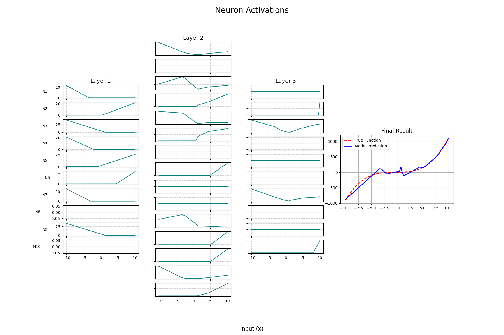

# nn-playground

A playground to explore neural networks in depth.

## Contents

* [Quick Start](#quick-start-)
* [Activation Visualization](#activation-visualization)

## Quick Start

Install the project dependencies from `pyproject.toml` and activate the virtual environment.

```bash
uv sync
source .venv/bin/activate
```

## Activation Visualization

Visualize activiation functions.

```
uv sync
source .venv/bin/activate
python run.py -o plots/nn-activations.png
```

**sample Output** (for y = x³ + x² + x +1)

